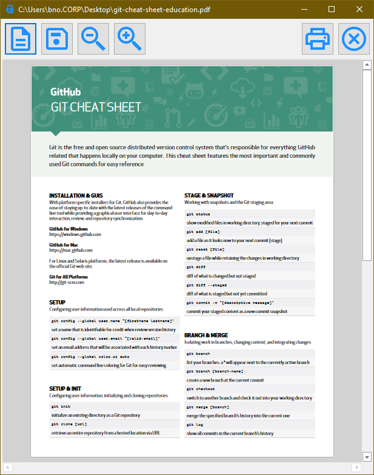

# PdfReader
There is a point where all the bloat and pushy 'services' are enough, and you simply want to view your PDF file. This little reader does just that, nothing more, nothing less. It is little more then a simple wrapper around a very capable PDF control and as such get's the job done without any bels or whistles.

Note: 
The installer contains everything you need to just 'install and run'. If you want to build this yourself, you need the DevExpress suite that this project references. (https://www.devexpress.com/#ui ). As such, this source code is not very usefull, but may still serve an examplary purpose. 

